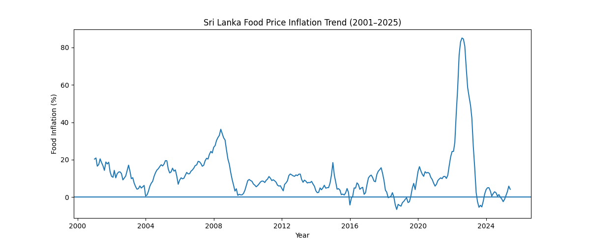
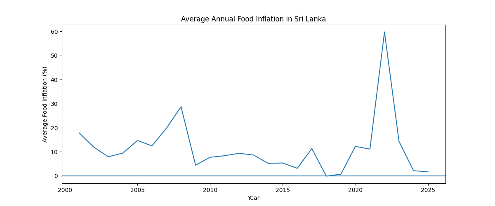

# Sri Lanka Food Price Inflation Analysis (2001–2025)

## Objective
Analyze long-term food price inflation trends in Sri Lanka using monthly data from 2001 to 2025 to understand cost of living changes and economic instability.

## Dataset
International food price inflation dataset containing monthly observations.

## Tools & Technologies
- Python
- Pandas
- Matplotlib
- Jupyter Notebook

## Key Insights
- Food price inflation remained relatively stable between 2001 and 2019.
- A historic spike occurred in 2022, with food inflation peaking above 80%.
- Inflation declined sharply after 2022, indicating stabilization.
- Post-2020 trends show significantly higher volatility.

## Visualizations

### Monthly Food Inflation Trend


### Average Annual Food Inflation


## Project Structure
- data/ - raw and cleaned datasets
- notebooks/ - analysis notebook
- outputs/ - generated charts

## How to Run the Project
1. Clone the repository:
```bash
git clone https://github.com/isiwarakumaragama/sri-lanka-food-inflation-analysis.git 
```

2. Navigate into the project directory:
```bash
cd sri-lanka-food-inflation-analysis
```

3. Create and activate a virtual environment:
```bash
python -m venv venv
venv\Scripts\activate        # Windows
source venv/bin/activate    # macOS/Linux
```

4. Install required dependencies:
```bash
pip install -r requirements.txt
```

5. Run the Jupyter Notebook:
```bash
jupyter notebook
```

## Outcome
This project demonstrates:

- Real-world data cleaning and preprocessing

- Time-series analysis using Python

- Data visualization and trend interpretation

- Ability to extract economic insights from large datasets